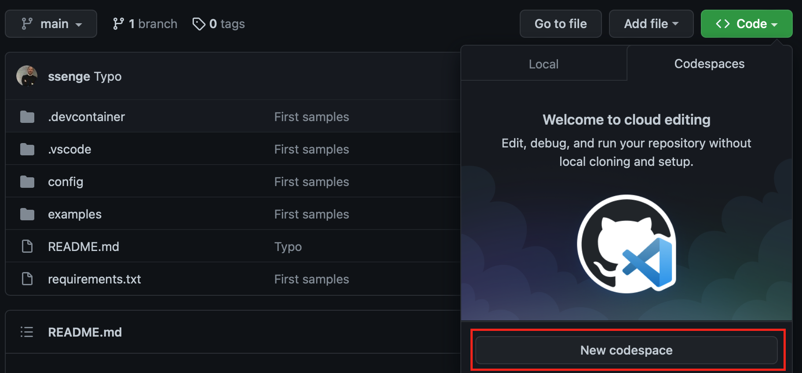

# Quantum Computing Template For GitHub's Codespaces

## Start developing in less than 3 minutes
Template for a full-fledged Quantum Computing development environment, incl. examples. The environment includes all common frameworks and libraries (Python, Anaconda, Qiskit, DWave Ocean, Cirq, PennyLane, ...) and can be setup in less than 3 minutes! Works in browsers (also on iPads) and in the VS Code desktop application.

Running an example in the web browser:

Running an example in the VS Code desktop app:

## How to use

1. **GitHub Organization owner:** Fork template into a repository owned by a GitHub Organization (for the time being, GitHub Codespaces does not work with repositories owned by individuals)
2. **GitHub Organization owner:** Add users to the Organization, allow Codespace access
3. **Users:** Click on the repository's web page on "Code -> Codespaces -> New Codespace", a new Codespace setup takes typically less than 3 minutes (wait until pip installed all requirements)

5. **Users:** Open one of the examples and run it
